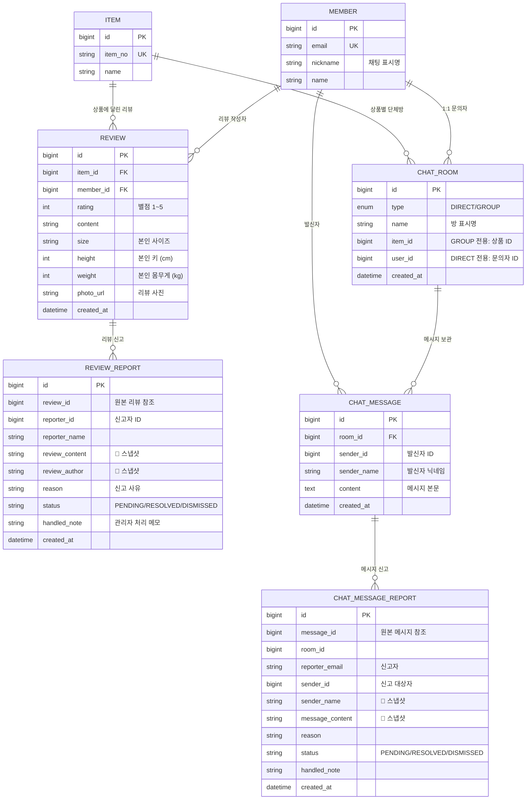

# 👕 MUREAM (무림)

> **의류 렌탈 · 경매 쇼핑몰 + AI 챗봇**  
> 무신사(스타일)와 크림(거래)을 결합한 컨셉의 풀스택 웹 서비스

<!-- 배지(샘플): 본인 저장소 이름으로 수정 후 주석 해제 -->
<!--  -->
<!--  -->

---

## 📌 프로젝트 개요

| 항목 | 내용 |
|---|---|
| **프로젝트명** | MUREAM (무림) |
| **개발 기간** | 2026.03.09 ~ 2026.04.02 (약 25일) |
| **팀 구성** | 3인 |
| **나의 역할** | 백엔드(관리자), AI 챗봇, 크롤러, WebSocket, 리뷰/신고, AWS 배포 |
| **배포 환경** | AWS S3 + CloudFront + EC2 |

### 한 줄 소개

> 렌탈 · 경매 · 일반 구매를 모두 지원하고, **TF-IDF + KoBERT 하이브리드 AI 챗봇**과 **실시간 날씨 기반 OOTD 추천**으로 상담 · 추천을 자동화한 의류 쇼핑몰 플랫폼.

---

## 🏗 시스템 아키텍처

```
┌─────────────────┐      ┌─────────────────┐      ┌─────────────────┐
│  React Frontend │◄────►│ Spring Boot API │◄────►│  Python Chatbot │
│   (Vite + TS)   │      │   (JPA + JWT)   │      │ (Flask + KoBERT)│
└────────┬────────┘      └────────┬────────┘      └─────────────────┘
         │                        │
         │                ┌───────┴────────┐
         │                │                │
         │           ┌────▼────┐      ┌────▼────┐
         │           │  MySQL  │      │  Redis  │
         │           └─────────┘      └─────────┘
         │
         │  STOMP WebSocket (실시간 채팅)
         └─────────────────────────────────────────►
         
  🌐 배포: React → S3 → CloudFront / Spring Boot → EC2
```

---

## 🗂 ERD (Entity Relationship Diagram)

> **MUREAM** 시스템의 데이터베이스 구조를 도메인별로 그룹화하여 정리했습니다.  
> 백엔드 엔티티(JPA `@Entity`) 약 40개 중 핵심 도메인을 추려 시각화했습니다.

### 📊 전체 ERD

```mermaid
erDiagram
    %% ===== 회원 & 인증 =====
    MEMBER ||--o{ SOCIAL_ACCOUNT : "소셜 연동"
    MEMBER ||--o{ REFRESH_TOKEN : "JWT 갱신 토큰"
    MEMBER }o--o{ ROLE : "회원-역할 (member_role)"
    ROLE }o--o{ PERMISSION : "역할-권한 (role_permission)"
    MEMBER }o--o{ PERMISSION : "회원-직접권한 (member_permission)"

    %% ===== 상품 카탈로그 =====
    BRAND ||--o{ ITEM : "브랜드 보유"
    CATEGORY ||--o{ ITEM : "카테고리 분류"
    CATEGORY ||--o{ CATEGORY : "상하위 (self-ref)"
    ITEM ||--o{ ITEM_IMAGE : "상품 이미지"
    ITEM ||--o{ ITEM_OPTION : "사이즈/색상 옵션"
    ITEM ||--o{ ITEM_TAG : "태그 매핑"
    TAG ||--o{ ITEM_TAG : ""
    ITEM ||--o{ ITEM_FILTER : "필터 매핑"
    FILTER ||--o{ ITEM_FILTER : ""
    FILTER_GROUP ||--o{ FILTER : "필터 그룹"

    %% ===== 거래 (경매) =====
    MEMBER ||--o{ BUY_BID : "구매 입찰자"
    MEMBER ||--o{ SELL_BID : "판매 입찰자"
    ITEM ||--o{ BUY_BID : ""
    ITEM ||--o{ SELL_BID : ""
    ITEM_OPTION ||--o{ BUY_BID : ""
    ITEM_OPTION ||--o{ SELL_BID : ""
    ITEM ||--o{ CONCLUDED_TRADE : ""
    MEMBER ||--o{ CONCLUDED_TRADE : "구매자/판매자"

    %% ===== 렌탈 =====
    MEMBER ||--o{ RENTAL_ORDER : "대여자/판매자"
    ITEM ||--o{ RENTAL_ORDER : ""
    ITEM_OPTION ||--o{ RENTAL_ORDER : ""

    %% ===== 리뷰 & 신고 (본인 담당) =====
    MEMBER ||--o{ REVIEW : "리뷰 작성"
    ITEM ||--o{ REVIEW : "상품 리뷰"
    REVIEW ||--o{ REVIEW_REPORT : "신고 (스냅샷)"

    %% ===== 채팅 (본인 담당) =====
    CHAT_ROOM ||--o{ CHAT_MESSAGE : "메시지 보관"
    CHAT_MESSAGE ||--o{ CHAT_MESSAGE_REPORT : "메시지 신고 (스냅샷)"

    %% ===== 좋아요 =====
    MEMBER ||--o{ ITEM_LIKE : "상품 좋아요"
    ITEM ||--o{ ITEM_LIKE : ""
    MEMBER ||--o{ BRAND_LIKE : "브랜드 좋아요"
    BRAND ||--o{ BRAND_LIKE : ""

    %% ===== 감사 로그 =====
    MEMBER ||--o{ AUDIT_LOG : "행위자 기록"

    %% ===== 엔티티 필드 정의 =====
    MEMBER {
        bigint id PK
        string email UK "로그인 키"
        string name
        string nickname "채팅 표시명"
        string phone_number
        string password_hash "BCrypt"
        enum status "NORMAL/BLOCKED/WITHDRAWN"
        int point
        boolean email_verified
        datetime last_login_at
        datetime created_at
    }

    SOCIAL_ACCOUNT {
        bigint id PK
        bigint member_id FK
        enum provider "GOOGLE/KAKAO/NAVER"
        string provider_user_id
        string provider_email
    }

    REFRESH_TOKEN {
        bigint id PK
        bigint member_id FK
        string token_hash
        datetime expires_at
    }

    ROLE {
        bigint id PK
        string name
        string description
    }

    PERMISSION {
        bigint id PK
        string code UK
        string name
        string description
    }

    BRAND {
        bigint id PK
        string code UK
        string name_ko
        string name_en
        string icon_image_url
        boolean exclusive_yn
        int like_cnt
    }

    CATEGORY {
        bigint id PK
        bigint parent_id FK "상위 카테고리"
        string name
        string code UK
        int depth
        string image_url
    }

    ITEM {
        bigint id PK
        string item_no UK "9자리 0-패딩"
        bigint brand_id FK
        bigint category_id FK
        string name
        int retail_price "정가"
        int rental_price "1일 렌탈가"
        string item_mode "AUCTION/RENTAL/BOTH"
        string status "판매중/품절/숨김"
        int like_cnt
        int view_cnt
    }

    ITEM_OPTION {
        bigint id PK
        bigint item_id FK
        bigint source_tag_id FK
        string option_value "사이즈/색상"
        enum rental_status "AVAILABLE/RENTED/INSPECTING"
    }

    ITEM_IMAGE {
        bigint id PK
        bigint item_id FK
        enum image_type "MAIN/DETAIL/THUMBNAIL"
        string image_url
        int sort_order
    }

    ITEM_TAG {
        bigint id PK
        bigint item_id FK
        bigint tag_id FK
    }

    ITEM_FILTER {
        bigint id PK
        bigint item_id FK
        bigint tag_id FK "Filter 참조"
    }

    TAG {
        bigint id PK
        string code UK
        string name
    }

    FILTER {
        bigint id PK
        bigint filter_group_id FK
        string code UK
        string name
        string color_hex
    }

    FILTER_GROUP {
        bigint id PK
        string code UK
        string name
        boolean multi_select_yn
        enum group_role
    }

    BUY_BID {
        bigint id PK
        bigint item_id FK
        bigint item_option_id FK
        bigint buyer_id FK
        int price "입찰가"
        enum status "PENDING/MATCHED/CANCELED"
        int payment_amount
        string payment_id "PortOne"
    }

    SELL_BID {
        bigint id PK
        bigint item_id FK
        bigint item_option_id FK
        bigint seller_id FK
        int price "판매 호가"
        enum status "PENDING/MATCHED/CANCELED"
    }

    CONCLUDED_TRADE {
        bigint id PK
        string trade_no UK
        bigint item_id FK
        bigint buyer_id FK
        bigint seller_id FK
        int trade_price "체결가"
        string courier
        string tracking_number
        string receiver_name
        string road_address
    }

    RENTAL_ORDER {
        bigint id PK
        string order_no UK
        bigint seller_id FK
        bigint renter_id FK
        bigint item_id FK
        bigint item_option_id FK
        string status "주문/대여중/반납/연체"
        date start_date
        date end_date
        int rental_price
        int deposit "보증금"
    }

    REVIEW {
        bigint id PK
        bigint item_id FK
        bigint member_id FK
        int rating "별점 1-5"
        string content
        string size "체험 사이즈"
        int height "체험자 키"
        int weight "체험자 몸무게"
        string photo_url
    }

    REVIEW_REPORT {
        bigint id PK
        bigint review_id "참조 (스냅샷 패턴, FK 없음)"
        bigint reporter_id
        string reporter_name
        string review_content "📸 신고 시점 스냅샷"
        string review_author "📸 신고 시점 스냅샷"
        string reason
        string status "PENDING/RESOLVED/DISMISSED"
        string handled_note
    }

    CHAT_ROOM {
        bigint id PK
        enum type "DIRECT/GROUP"
        string name "방 표시명"
        bigint item_id "GROUP: 상품 단체방"
        bigint user_id "DIRECT: 1:1 문의자"
    }

    CHAT_MESSAGE {
        bigint id PK
        bigint room_id FK
        bigint sender_id
        string sender_name
        text content
    }

    CHAT_MESSAGE_REPORT {
        bigint id PK
        bigint message_id "참조 (스냅샷 패턴)"
        bigint room_id
        string reporter_email
        bigint sender_id
        string sender_name
        string message_content "📸 신고 시점 스냅샷"
        string reason
        string status
    }

    ITEM_LIKE {
        bigint id PK
        bigint member_id FK
        bigint item_id FK
        datetime created_at
    }

    BRAND_LIKE {
        bigint id PK
        bigint member_id FK
        bigint brand_id FK
        datetime created_at
    }

    AUDIT_LOG {
        bigint id PK
        enum category "AUTH/MEMBER/ITEM/..."
        enum event_type
        enum result "SUCCESS/FAILURE"
        bigint actor_id
        string actor_email
        string ip_address
        string request_uri
    }
```



---

### 🔍 본인 담당 도메인 — 리뷰/신고 + 채팅 시스템 (Zoom-in)

> 회원·상품 영역과 분리하여, 제가 직접 설계한 **리뷰/신고**와 **WebSocket 채팅** 도메인을 자세히 보여드립니다.  
> 두 영역 모두 **'신고 스냅샷 패턴'** 으로 원본 데이터가 삭제돼도 신고 이력이 보존되도록 설계했습니다.



### 🎯 ERD 설계 포인트 (본인 담당)

| 설계 결정 | 이유 | 효과 |
|---|---|---|
| **신고 스냅샷 패턴** (REVIEW_REPORT, CHAT_MESSAGE_REPORT) | 신고 시점에 본문·작성자를 복사 저장하여 원본 삭제와 무관하게 증거 보존 | 원본 리뷰/메시지가 삭제돼도 **신고 이력 영구 보존** → 분쟁 시 근거 자료로 활용 가능 |
| **3단계 상태 머신** (PENDING → RESOLVED / DISMISSED) | 신고 라이프사이클을 명확히 모델링 | 관리자 페이지에서 **처리 흐름 가시화** + 재신고 방지 |
| **CHAT_ROOM 단일 테이블** (DIRECT/GROUP 통합) | `type` enum + `item_id` / `user_id` 분기 처리 | 별도 테이블 분리 없이 **1:1 문의**와 **상품 단체방** 동시 지원 |
| **중복 신고 방지** (`existsByReviewIdAndReporterId`) | 같은 사용자가 같은 리뷰를 여러 번 신고하지 못하도록 DB 쿼리 단에서 차단 | **무분별한 신고로 인한 시스템 악용 방지** |

---

## 🛠 기술 스택

### Backend
- **언어/프레임워크:** Java 17, Spring Boot, Spring Security
- **DB/ORM:** MySQL, Spring Data JPA (Hibernate), Redis
- **인증:** JWT (Access/Refresh), OAuth2 (Google / Kakao / Naver)
- **실시간:** STOMP WebSocket + SockJS
- **문서화:** Swagger (SpringDoc OpenAPI)

### Frontend
- **언어/프레임워크:** TypeScript, React 19, Vite
- **상태 관리:** Zustand
- **라우팅:** React Router v7
- **HTTP:** Axios (JWT 인터셉터 + 401 재로그인 처리)
- **결제:** PortOne V2

### AI Chatbot
- **언어:** Python 3.10
- **모델:** TF-IDF + KoBERT(KR-ELECTRA) **하이브리드**
- **프레임워크:** Flask, TensorFlow / Keras (legacy)
- **부가:** Open-Meteo API (날씨 기반 OOTD 추천)

### Crawler
- **수집:** Python `urllib.request` + `ThreadPoolExecutor` 병렬 처리
- **안정성:** 재시도 4회 + User-Agent 위장 + 정규식 기반 Next.js `__NEXT_DATA__` 추출
- **연동:** Spring Boot `ProcessBuilder` → 자식 프로세스로 Python 실행 → stdout JSON을 Jackson으로 역직렬화

### Infra / DevOps
- **클라우드:** AWS S3 (정적 호스팅) + CloudFront (CDN) + EC2 (백엔드)
- **컨테이너:** Docker (MySQL · Redis 환경 구성)

---

## 🙋‍♂️ 나의 주요 담당 영역

> 신입 개발자로서 백엔드 · AI · 인프라까지 폭넓게 담당하며 풀스택 통합 경험을 쌓았습니다.

### 1. AWS 통합 배포 (프론트엔드 + 백엔드)
- **프론트엔드**: React + Vite 빌드 → **S3 정적 호스팅** → **CloudFront CDN** 배포
- **백엔드**: Spring Boot → **EC2** 배포, 보안그룹 인바운드 규칙 직접 관리
- CloudFront Behavior 규칙(`/api/*`, `/uploads/*`, `/ws/*`)으로 EC2 백엔드 프록시 연결
- `.env` 환경변수 분리 + `.gitignore`로 시크릿 노출 차단

### 2. WebSocket 기반 실시간 채팅
- `ChatRoom · ChatMessage · ChatParticipant · ChatReport` **4개 도메인 ERD 설계**
- STOMP `/topic` (브로드캐스트), `/queue` (개인), `/app` (서버 수신) 라우팅 규칙 정의
- **JWT WebSocket 인증 인터셉터**(`WebSocketAuthChannelInterceptor`)로 인증된 사용자만 채팅 참여 허용
- 1:1 문의방 / 상품별 단체방을 `ChatRoomType enum(DIRECT/GROUP)`으로 분기 처리

### 3. AI 챗봇 (Python) 단계별 개발
- **Seq2Seq LSTM → TF-IDF → TF-IDF + KoBERT 하이브리드**로 단계 발전 (자세한 내용은 트러블슈팅 참고)
- **858개 QA 데이터셋 직접 구축** 및 6개 카테고리 키워드 필터링
- 임베딩 캐시(`embeddings_cache.npy`)로 응답 속도 최적화
- 유사도가 낮을 때는 **카테고리 버튼 폴백 UX**로 자연스러운 안내
- Open-Meteo API 연동 → 실시간 기온 · 체감온도 · 습도 기반 **OOTD 의류 추천**
- Flask 서버에서 Spring 백엔드의 `/api/categories`와 연동, 추천 상품 카드와 상세 링크까지 자동 매칭

### 4. 관리자 페이지 + 리뷰/신고 시스템
- **관리자 페이지**: 이메일 · 이름 · 역할 · 상태별 **다중 검색 + 페이징 + CRUD**
- **신고 스냅샷 패턴 직접 설계**: 신고 시점에 리뷰 본문 · 작성자를 `ReviewReport` 테이블에 복사 저장 → 원본 리뷰가 삭제돼도 **신고 이력은 증거로 영구 보존**
- **신고 상태 머신**: `PENDING (접수) → RESOLVED (리뷰 삭제 + 처리완료) / DISMISSED (반려)` 3단계 라이프사이클로 신고 처리 흐름 명확화
- **중복 신고 방지**: `existsByReviewIdAndReporterId` 쿼리로 같은 사용자가 동일 리뷰를 중복 신고하는 것 차단
- **관리자 액션 분기**: `RESOLVE` 액션은 원본 리뷰까지 자동 삭제, `DISMISS` 액션은 신고만 반려 처리

### 5. 상품 크롤러 — Java ↔ Python 연동
- Python `urllib`로 외부 사이트 내부 JSON API를 직접 호출하는 **효율적 수집 구조** 설계
- `ThreadPoolExecutor` 멀티스레드 적용으로 상세 · 태그 · 옵션 3개 요청 병렬 처리
- 재시도 4회 + User-Agent 위장 + 정규식 기반 `__NEXT_DATA__` 추출로 안정성 확보
- Spring Boot `ProcessBuilder`로 Python을 자식 프로세스로 실행 → stdout JSON을 Jackson으로 역직렬화하는 **Java↔Python 연동 구조** 직접 구현

---

## 📸 주요 기능

| 기능 | 설명 |
|---|---|
| 회원 관리 | JWT 인증 + 소셜 로그인 (Google · Kakao · Naver) |
| 관리자 페이지 | 회원 검색 · 필터 · CRUD, 권한 · 감사 로그 관리 |
| 상품 | 렌탈 / 경매 / 일반 구매 분기 |
| 리뷰 / 신고 | 신고 스냅샷 패턴 + 3단계 상태 머신 (PENDING → RESOLVED / DISMISSED), 중복 신고 차단 |
| 실시간 채팅 | 1:1 관리자 문의 + 상품별 단체 채팅 (STOMP + SockJS) |
| AI 챗봇 | TF-IDF + KoBERT 하이브리드, 카테고리별 추천 |
| OOTD 추천 | 실시간 날씨 기반 의류 추천 → 상품 자동 매칭 |
| 상품 크롤러 | Python으로 외부 데이터 수집 후 자체 적재 (Java↔Python 연동) |

<!-- 시연 영상 / 스크린샷이 있다면 아래에 추가 -->
<!-- 🎬 **시연 영상:** https://youtu.be/... -->
<!-- 📷 **스크린샷:** `docs/screenshots/` 폴더 참고 -->

---

## 📁 프로젝트 구조

```
clothing-shop/
├── frontend/         # React 19 + Vite + TypeScript
│   ├── src/
│   ├── public/
│   └── package.json
│
├── backend/          # Spring Boot + JPA
│   ├── src/main/java/com/example/demo/
│   │   ├── admin/        # 관리자 (회원 관리, 권한, 감사 로그)
│   │   ├── auth/         # JWT 인증/인가, OAuth2
│   │   ├── catalog/      # 상품 / 브랜드 / 카테고리 / 크롤러
│   │   ├── chat/         # WebSocket 실시간 채팅
│   │   ├── member/       # 회원 도메인
│   │   ├── rental/       # 렌탈 주문
│   │   ├── review/       # 리뷰 / 신고
│   │   └── trade/        # 입찰 경매 / 결제 (PortOne)
│   ├── pom.xml
│   └── compose.yaml
│
├── chatbot/          # Python AI 챗봇 (Flask)
│   ├── app.py                    # Flask 진입점
│   ├── kobert_similarity.py      # KoBERT 임베딩 + 유사도
│   ├── weather_service.py        # Open-Meteo 연동
│   ├── weather_outfit.py         # OOTD 추천 로직
│   ├── product_bridge.py         # Spring 백엔드 연동
│   ├── data/                     # 858개 QA 데이터
│   ├── legacy/                   # 초기 Seq2Seq LSTM
│   └── requirements.txt
│
├── .gitignore
└── README.md
```

---

## 🚀 실행 방법

### 사전 준비
- Java 17, Node.js 20+, Python 3.10, Docker Desktop

### 1) 백엔드 실행
```bash
cd backend
cp .env.properties.example .env.properties   # 환경변수 설정 후 값 입력
docker compose up -d                          # MySQL + Redis 실행
./mvnw spring-boot:run
```

### 2) 프론트엔드 실행
```bash
cd frontend
cp .env.example .env                          # 환경변수 설정
npm install
npm run dev
```

### 3) 챗봇 실행
```bash
cd chatbot
python -m venv venv
venv\Scripts\activate                          # Windows
# source venv/bin/activate                     # macOS / Linux
pip install -r requirements.txt
python app.py
```

### 환경변수 안내
- 각 폴더의 `.env.example` 참고
- OAuth2 클라이언트 ID / Secret은 Google / Kakao / Naver Developer 콘솔에서 발급

---

## 🤔 트러블슈팅

### AI 챗봇 Seq2Seq 모델의 답변 품질 문제

#### 문제
처음에는 **Seq2Seq LSTM** 모델로 챗봇을 구현했습니다. 300 epoch까지 학습시켰지만, 의류 도메인 질문에 대한 답변이 일관되지 않았고 같은 질문에도 매번 다른 답이 나오는 현상이 발생했습니다.

#### 원인
직접 구축한 **858개 QA 데이터셋**이 Seq2Seq 모델 학습에 필요한 양에 비해 너무 적었습니다. 일반적으로 Seq2Seq 같은 생성형 모델은 수십만 건 이상의 데이터가 필요한데, 도메인 특화 단어조차 충분히 학습되지 못한 상태였습니다.

#### 해결
검색해보니 **데이터가 적을 때는 검색형(retrieval-based) 모델이 더 안정적**이라는 자료를 찾았습니다. 생성형을 포기하고 다음과 같이 구조를 전면 개편했습니다.

1. **TF-IDF**로 858개 QA 중 후보 20개를 빠르게 추림 (1차 필터링)
2. **KoBERT(KR-ELECTRA)** 가 의미적 유사도로 최종 답변을 선택 (2차 정밀 검색)
3. **6개 카테고리 키워드 필터**로 의류 도메인 외 질문을 사전 차단
4. **유사도가 낮을 때는** 자연스러운 안내 메시지와 함께 **카테고리 버튼 폴백 UX** 제공
5. 자주 묻는 질문은 임베딩을 사전 계산하여 `embeddings_cache.npy`로 캐싱

#### 성과
- 답변 정확도가 눈에 띄게 향상되었고, 모호한 질문도 자연스럽게 카테고리 버튼으로 유도
- **응답 시간: 캐싱 적용 전 2~3초 → 적용 후 200ms 이내**
- **배운 점:** 무조건 최신 기술로 모델 선택을 하여 정확도를 올리는거 보다 데이터의 양과 도메인 특성에 따라 때로는 롤백 처리를 잘 활용하는 것이 효율적 판단이라는 것을 체감하였습니다. 그리고 반복되는 임베딩 연산은 캐싱만으로 10배 이상의 성능 개선이 가능하다는 점을 배워 직접 구현한 경험이 되었습니다.

---

## 👥 팀 구성 및 역할 분담

| 이름 | 역할 | 담당 영역 |
|---|---|---|
| **신상훈** (본인) | 조원 | **AI 챗봇** (TF-IDF + KoBERT 하이브리드), **상품 크롤러** (Java ↔ Python 연동), **WebSocket 실시간 채팅** (4개 도메인 ERD + JWT 인증 인터셉터), **리뷰/신고 시스템**, 관리자 페이지, **AWS S3 + CloudFront + EC2 통합 배포** |
| **황시영** | 조장 | 회원 도메인 (JWT 인증 · OAuth2 소셜 로그인), 결제 모듈 (PortOne V2), 프론트엔드 전체 아키텍처 (Vite 빌드 환경 · Zustand 상태 관리 · Axios 인터셉터), API 명세 / ERD 통합 · 일정 관리 |
| **김재혁** | 조원 | 상품 도메인 (브랜드 · 카테고리 · 필터 · 태그), 입찰 경매 시스템 (실시간 호가, BuyBid / SellBid), 렌탈 주문 시스템 (RentalOrder · 연체 감지 · 반납), 메인 / 상품 상세 페이지 UI |

---

## 📚 참고 자료

- [KoBERT GitHub](https://github.com/SKTBrain/KoBERT)
- [Spring Security OAuth2 공식 문서](https://docs.spring.io/spring-security/reference/servlet/oauth2/index.html)
- [PortOne V2 API](https://developers.portone.io/api/rest-v2?v=v2)
- [Open-Meteo API](https://open-meteo.com/)

---

## 📝 라이선스

This project is for educational and portfolio purposes only.
